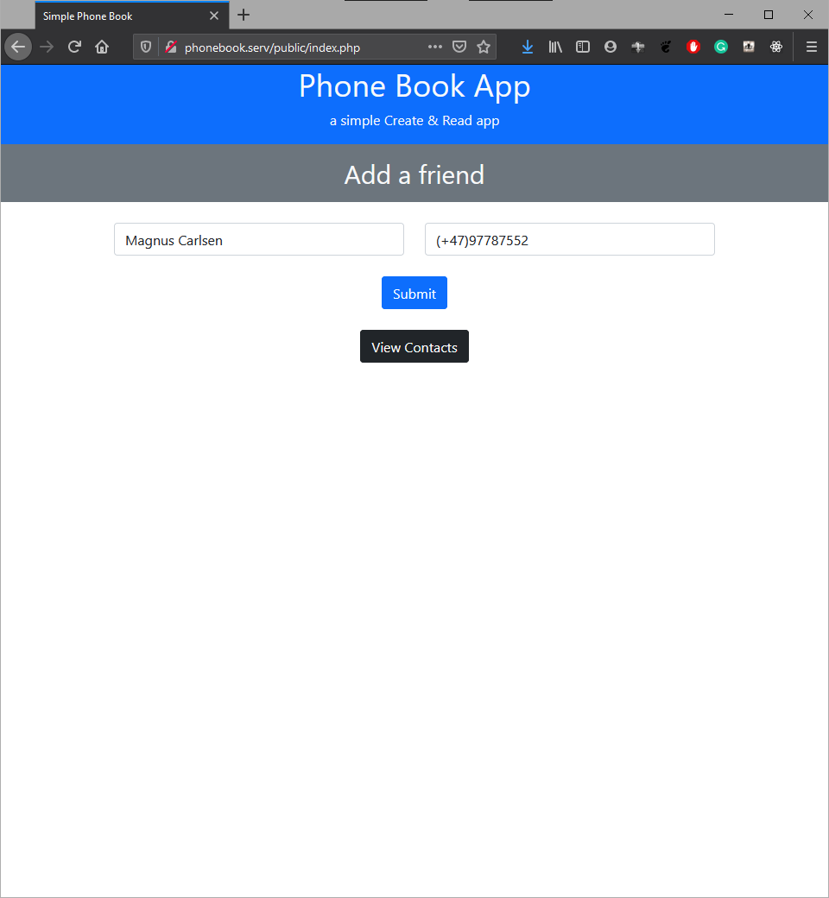
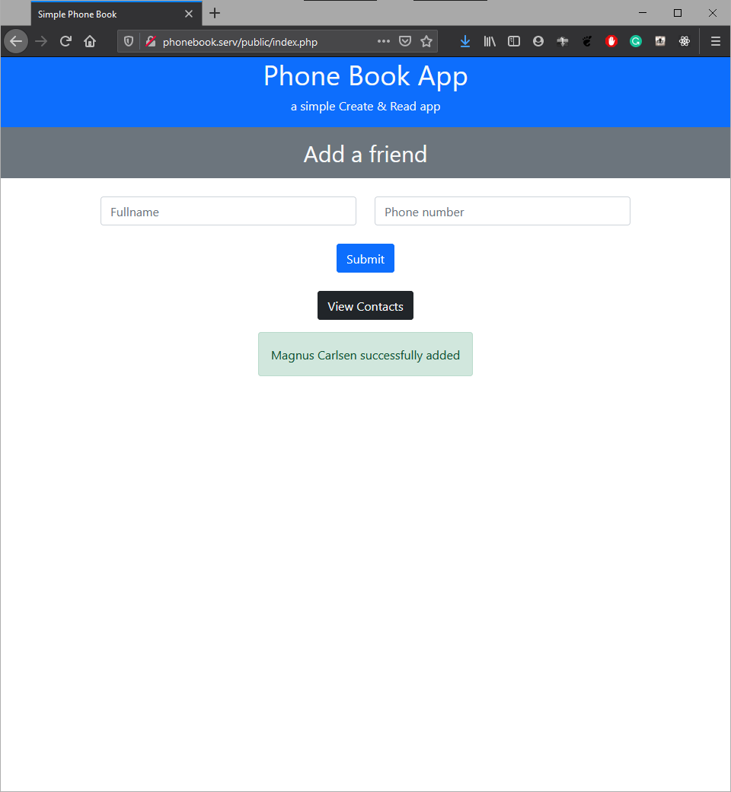
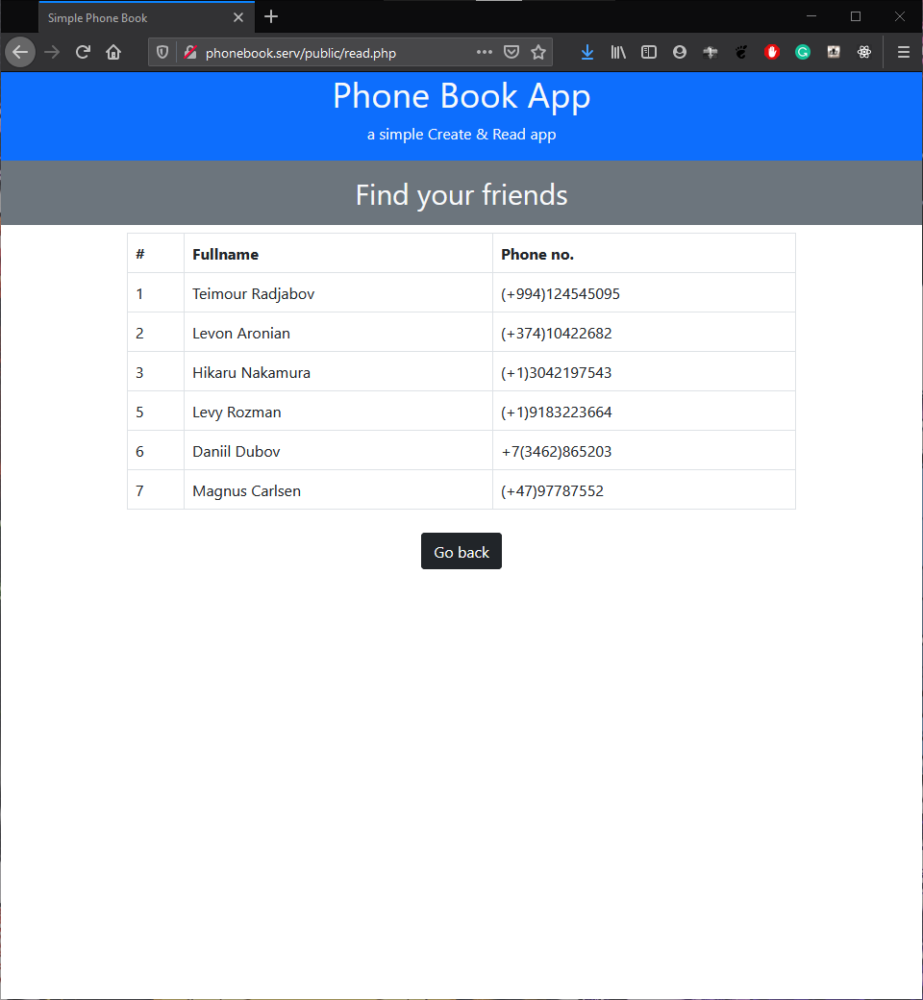
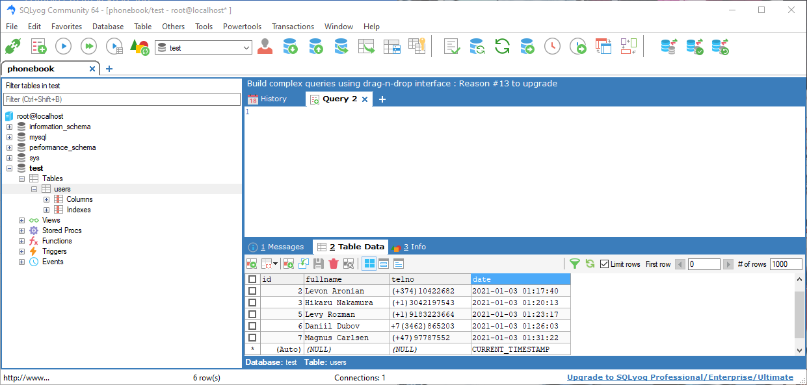

[![Forks][forks-shield]][forks-url]
[![Stargazers][stars-shield]][stars-url]
[![Issues][issues-shield]][issues-url]
[![MIT License][license-shield]][license-url]
[![LinkedIn][linkedin-shield]][linkedin-url]

<!-- ABOUT THE PROJECT -->
## About The Project

Simple create-and-read web app that adds your friends' contact and view them on the site.

### Built With

* [PHP](https://www.php.net/)
* [MySQL](https://www.mysql.com/)

<!-- GETTING STARTED -->
## Getting Started

Set up MAMP and virtual host

### Prerequisites

1. PHP Environment
2. [MAMP](https://www.mamp.info/en/windows/)

<!-- USAGE EXAMPLES -->
## Screenshots
1. Home page - simple form to add your friends' contacts

2. Success alert after successfully add your friend's contact

1. Contact page - view your added friends' contact

4. Database - User's table to store your friends' contact

<!-- LICENSE -->
## License

Distributed under the MIT License. See `LICENSE` for more information.

<!-- CONTACT -->
## Contact

Your Name - [@mu4m3](https://twitter.com/mu4m3) - m.amiruddin27@gmail.com

Project Link: [https://github.com/amrnumenor/simple-phonebook](https://github.com/amrnumenor/simple-phonebook)

<!-- MARKDOWN LINKS & IMAGES -->
<!-- https://www.markdownguide.org/basic-syntax/#reference-style-links -->
[contributors-shield]: https://img.shields.io/github/contributors/amrnumenor/repo.svg?style=for-the-badge
[contributors-url]: https://github.com/amrnumenor/simple-phonebook/graphs/contributors
[forks-shield]: https://img.shields.io/github/forks/amrnumenor/simple-phonebook.svg?style=for-the-badge
[forks-url]: https://github.com/amrnumenor/simple-phonebook/network/members
[stars-shield]: https://img.shields.io/github/stars/amrnumenor/simple-phonebook.svg?style=for-the-badge
[stars-url]: https://github.com/amrnumenor/simple-phonebook/stargazers
[issues-shield]: https://img.shields.io/github/issues/amrnumenor/simple-phonebook.svg?style=for-the-badge
[issues-url]: https://github.com/amrnumenor/simple-phonebook/issues
[license-shield]: https://img.shields.io/github/license/amrnumenor/simple-phonebook.svg?style=for-the-badge
[license-url]: https://github.com/amrnumenor/simple-phonebook/blob/master/LICENSE.txt
[linkedin-shield]: https://img.shields.io/badge/-LinkedIn-black.svg?style=for-the-badge&logo=linkedin&colorB=555
[linkedin-url]: https://www.linkedin.com/in/muhammad-amiruddin-bustaman-94927a1a7/
 
